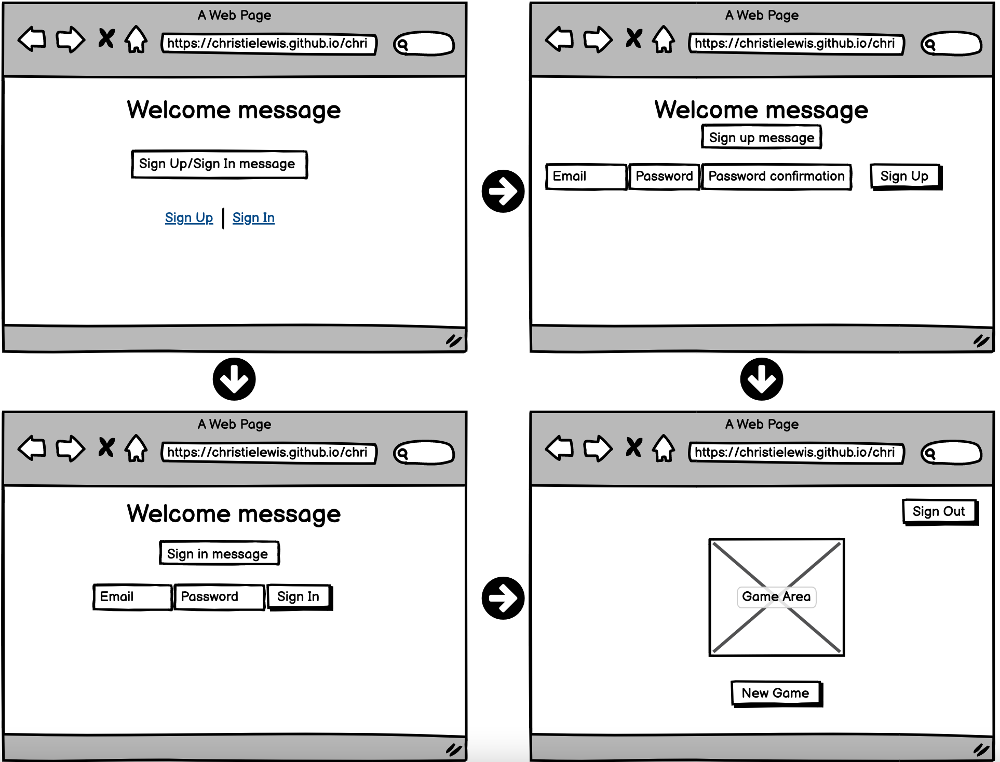

# Tic-Tac-Toe 

## Description
I am building a functioning, debugged Tic Tac Toe game.

## User Stories
* User will be able to sign up with:
    * user email address, 
    * password, and 
    * password confirmation.
* User can sign in to their account
* User can sign out of their account, once signed up.
* User can play a game of tic-tac-toe
* User will be able to alternate between "X" and "O" with each click.
* User can only click on available spaces not already occupied.
* User will be notified game status (win, tie, loss).
* User cannot continue playing once game over.
* User can play again by clicking "New Game" button to restart.

## Wireframe
